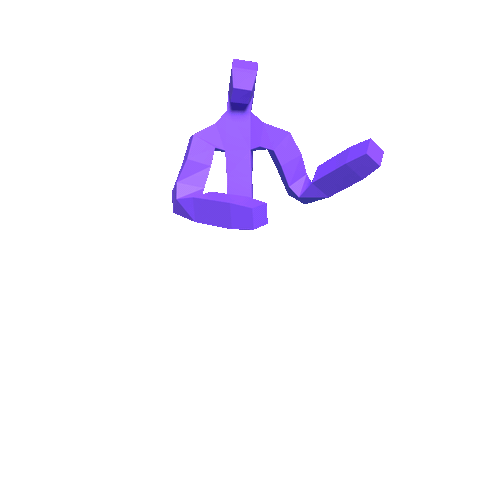

# MotionVisualizationBlender

## Blender Animation (from a generated PKL file)

Versions:

* Blender 2.79B                    
(Latest Blender 2.8 version will be supported later.)
* FFMPEG git-2020-05-10-fc99a24 


Assure the file path structure as following:


```
┌─ Blender file (poseRender.blend) 
├─ Codec (h264_in_MP4.py)
└─ [Data Folder] 
    ├── A generated PKL file (.pkl)
    └── Audio file (.wav) 
```
- Place the codec file as the same path with `.blend` file.
- Confirm the `.pkl` and `.wav` files in the data folder. 


Open blender file and set configuration :


```
1. data_folder                                       ## Name of Data Folder 
2. render_dir                                        ## Name of Render Folder
3. target_file                                       ## * : for all files, 
                                                       Names of file : render a specific file
4. You can change the details of render setting 
  - character_num                                    ## default is "123", 
                                                        If you create a new mesh, you could change this. 
                                                        This is corresponding with camera number.
  - resolution_percentage                            ## default is 100
  - render_video                                     ## True : render video, 
                                                        False : render image frames only
  - test_run                                         ## True : render 10 frames for the test,
                                                        False : render all frames
  - upsample
  - out_fps 
  - verbose 
  - etc
```

You can find the details `renderAnim.py` in blender file.

If you success the path and configuration set up, 
Press <Run Script> button and Enjoy! 

you can see the render output as below.




## License

Please see `LICENSE.md`


## Citation

If you find our work useful in your research, please consider citing:

```
@article{Yoon2020Trimodal,
  title={Speech Gesture Generation from the Trimodal Context of Text, Audio, and Speaker Identity},
  author={Youngwoo Yoon and Bok Cha and Joo-Haeng Lee and Minsu Jang and Jaeyeon Lee and Jaehong Kim and Geehyuk Lee},
  journal={ACM Transactions on Graphics},
  year={2020},
  volume={39},
  number={6},
}
```

Ref. https://github.com/ai4r/Gesture-Generation-from-Trimodal-Context
